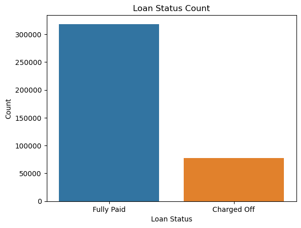
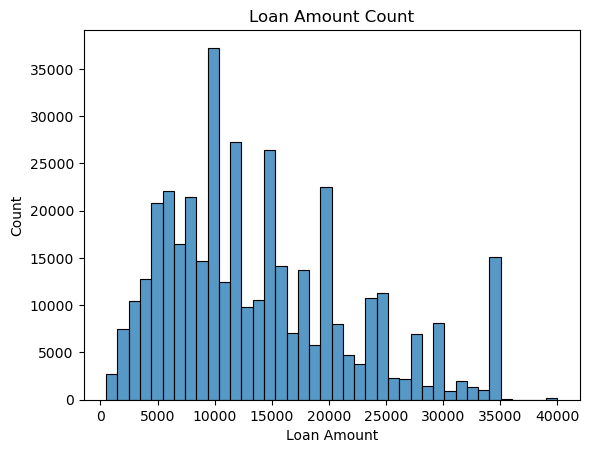
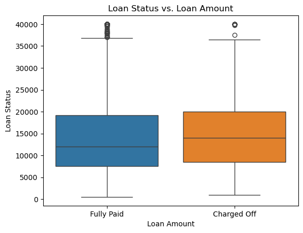
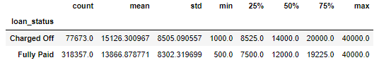
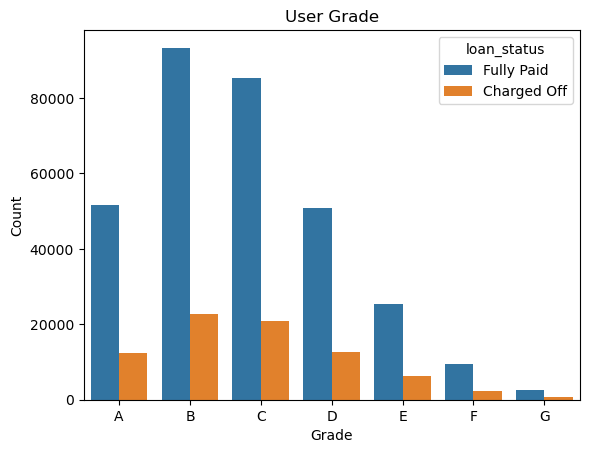
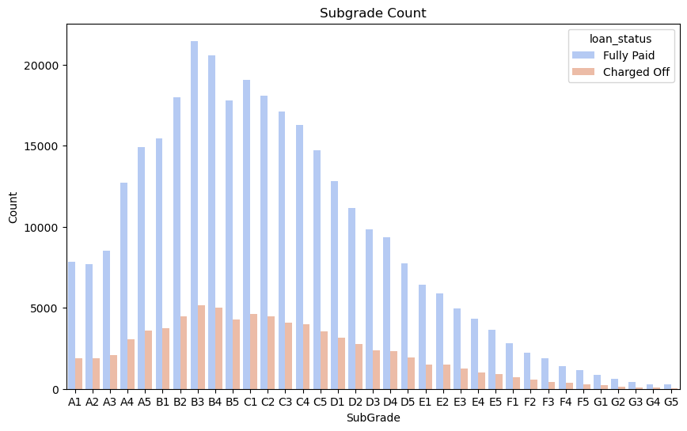
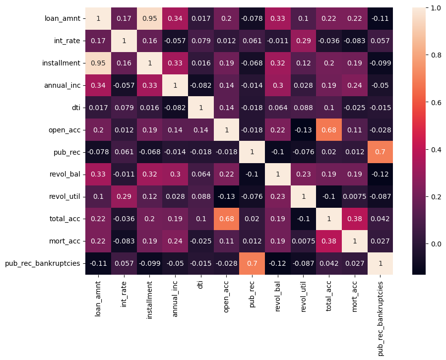
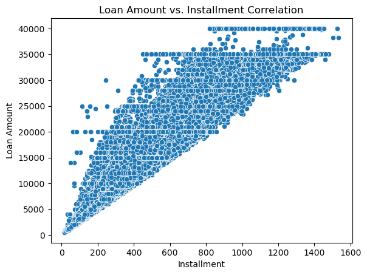
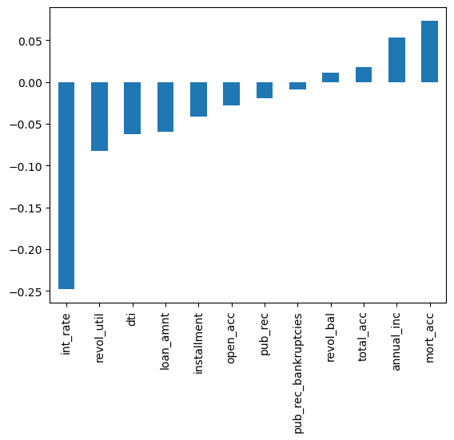

# Lending Club End-to-End Project

## Overview
This project utilizes a dataset from LendingClub, a US-based peer-to-peer lending company, to build a deep learning model that predicts whether borrowers will pay back their loans. **The primary objective of this project is to aid LendingClub in assessing the risk of loan applications, enhancing decision-making processes for loan approvals.** The model is developed using Keras, a powerful deep learning library. The methodologies involded include Data Preprocessing, feature engineering, and a neural network model.

***Data Overview***
The dataset is a subset of the LendingClub data available on Kaggle, which has been specially modified to demonstrate feature engineering techniques. It includes various attributes of loans and borrowers such as loan amount, interest rate, borrower"s employment length, credit history, and more.

The dataset includes:

loan amount, loan term, interest rate, monthly payment, loan status, loan grade, loan subgrade, employment title, employment length, home ownership status, annual income, income verification status, loan issue date, loan purpose, loan title, borrower"s state and zipcode, debt-to-income ratio, earliest credit line, number of open credit accounts, number of derogatory public records, total revolving credit balance, revolving credit utilization, total credit lines, initial loan listing status, application type, number of mortgage accounts, and number of public record bankruptcies.

## <ins>EDA, Feature Engineering, and Data Preprocessing<ins> 
### <ins>Initial EDA<ins>

I visualized several the relationships in order to get a better understanding of the features and the correlations of those features.

Since we will be attempting to predict loan status, I started with a count plot of the loan statuses. There are many more loans that are Fully Paid compared to Charged off:

I then wanted to tsee the distribution of the loan amounts:

I then wanted to see if there was a relationship between the **loan status and the loan amount**. It seems that there"s a slight increase in likelihood of the loan not being paid off if it"s higher, which makes sense..

I dove deeper by looking at the summary statistics of the loan status and loan amount. This confirmed the initial findings:

Next I wanted to visualize the **“grade”** (LC assigned loan grade) and the rate of the loans being paid off. As expected, the better grades (ex. A) have a much higher likelihood of being paid off compared to lower grades (ex. G). 

I then wanted to visualize the **subgrade** to see if there was a clear distinction between the subgrades of the grades.

I dug deeper into the F and G subgrades because it"s not depicted well in the graph above, and there is a lot lower frequency. 

### <ins>correlations<ins>

To get a sense of the correlations for all the numeric columns, I created the heatmap below. The lighter the color, the more positevly correlated the two features are. There are very strong correlations between features like Number of public record bankruptcies, number of open accounts, total number of accounts, interest rate on the loan, report annual income, and more. These all make logical sense given the context and description. 

For example, there"s an almost perfect correlation with the "installment" and "loan_amnt" feature, which makes sense given that “installment” is the monthly payment owed by the borrower if the loan originates. I visualized these two features below:

I then wanted to see the correlations of the numeric columns to whether a loan was repaid. This correlation is useful for later on in the project...

## <ins>Feature Engineering and Data Preprocessing:<ins>
I found that the following columns had null values:

emp_title with 22927 null values, emp_length with 18301 null values, title with 1756 null values, revol_util with 276 null values, mort_acc with 37795 null values,
and pub_rec_bankruptcies with 535 null values.

### <ins>Filling in Data with Multi-Regression Models<ins>
Given that mort_acc was the most positively correlated to a loan being repaid (6.9% correlation) and it had more than ~9.5% of the rows values missing, I made sure to fill in the null values. I created a Multi- Regression model to fill in mort_acc based off the 8 highest correlated features, which included the total accounts (38%), annual income (24%), and loan amount (22%). This model had a Mean Absolute Error of 1.45, which is not badsince it represents a small deviation relative to the range of 1-34. I then used the model to predict the missing values for mort_acc.

I also made a seperate Multi-Regression model for both revol_util (1.1% correlation with a loan being repaid) and pub_rec_bankruptices, which didn"t have many missing values but might have an impact on other features that in turn impact whether a loan is paid off. I created the model to fill in missing values based off the the highest correlated features for the respective feature. For example:

* for revolving line utilization rate ("revol_util") - correlated features included "pub_rec (70%), revolv_bal (-12%), loan amount (-11%), and interest rate (5%). This model had a Mean Absolute Error of 1.45, which is not badsince it represents a small deviation relative to the range of 1-34. I then used the model to predict the missing values for mort_acc.

* for Number of public record bankruptcies ("pub_rec_bankruptices") - correlated features included "pub_rec (70%), revolv_bal (-12%), loan amount (-11%), and interest rate (5%). This model had a Mean Absolute Error of 1.45, which is not badsince it represents a small deviation relative to the range of 1-34. I then used the model to predict the missing values for mort_acc.

### <ins>Feature Engineering<ins>

* For the address feature, I extracted the first 3 letters of the zip code, which provides a geographic area which often pinpoints a sectional center facility (a central mail processing facility for an area). This can provide insights into local economic statuses. The address feature previously included the street address, town, and state. For example, a value is "0174 Michelle Gateway\nMendozaberg, OK 22690", but now it would only be "226". 

* For the home ownership feature, the "Mortgage" and "Rent" option had the most values, followed by "Own" with 38k, "Other" with 112, "None" with 31, and "Any" with 3. I grouped "None" and "Any" into "Other" since there"s a low count and to make the data cleaner. 

* For the earliest credit line ("earliest_cr_line") feature, I extracted the year. The column previously gave the month, an example being "Jun-1990", however I decided that the year was going to give me plenty of information and I didn"t want to overcomplicate my model.

* I extracted the numbers from "term", which was previously formatted as "## months", and then turned it into a numerical column.

### <ins>Removing Features & Rows<ins>

*I dropped the row that had a debt to income ratio ("dti") of 9999, which is likely due to an error.  

* I dropped the sub-grades and made "grade" into dummy variables. I did this because to have both would be redundant, and I believe "grade" captures the overall trend of the loans repaid ratio. There is not much difference between the subgrades, and there are also many subgrades with low frequency.

* I dropped the "title" because it is the same as the "purpose" feature but just in a different format, and it has null values.

* I dropped the "loan_status" because I made a "loan_repaid" column, with 0 = "Charge Off" and 1 = "Paid off"

Other things I tried to do

Categorized annual_inc -> there are too many unique incoms so I categorized the income by classes from the Census Bureau"s 2022 report for Income in the United States, with Lower class: less than or equal to $30,000, Lower-middle class:  30,001– 58,020, Middle class:  58,021– 94,000, Upper-middle class:  94,001– 153,000, and Upper class: greater than $153,000
Dti -> several outliers that are unrealistic or too high. For ex. 9999, +6000, etc. So I deleted the top 0.05% of the values
earliest_cr_line -> Extracted the year from earliest_cr_line then categorized by decade

